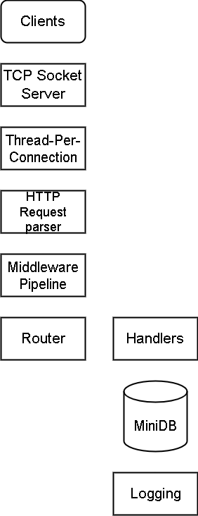

# From-Scratch HTTP Server with MiniDB

A minimal HTTP/1.1 server implemented **from raw TCP sockets in Python**, with a custom request parser, routing system, middleware pipeline, logging, threaded concurrency, and a network-accessible key-value database.

This project demonstrates **backend systems fundamentals** by building core web server components without using frameworks like Flask, FastAPI, or Django.

---

## Features

- Raw TCP socket server
- Custom HTTP/1.1 request parsing
- Routing system (`method + path`)
- Query parameter parsing
- POST request support
- JSON body parsing
- Thread-per-connection concurrency model
- Middleware pipeline
- Structured logging
- Simple in-memory key-value database (MiniDB)
- Benchmarking tool for load testing

---

## Architecture


---

## Project Structure
```bash
from-scratch-http
│
├── main.py # Core HTTP server
├── http_parser.py # HTTP request parsing logic
├── router.py # Route registration and resolution
├── middleware.py # Middleware pipeline
├── logger.py # Logging utilities
├── benchmark.py # Load testing script
│
├── database
│ └── minidb.py # In-memory key-value store
│
└── .gitignore
```
---

## Running the Server

Start the HTTP server:

```bash
python main.py
```

server runs on:
```bash
http://127.0.0.1:8080
```
Example Endpoints
Home
```bash
GET /
```

Response:
``` bash
Welcome to From Scratch HTTP Server
```
Hello Endpoint
```bash
GET /hello
```
Response:
```bash
Hello Guest
```
Query parameters supported:
```bash
GET /hello?name=Karthik
```
Response:
```bash
Hello Karthik
```
Insert Data
```bash
POST /insert
```
Body:
```json
{
  "key": "name",
  "value": "Karthik"
}
```
Response:
```bash
Inserted successfully
```
Query Data
```bash
GET /select?key=name
```
Response:
```bash
name = Karthik
```
Database Stats
```bash
GET /dbstats
```
Response:
```bash
Total keys: 1
```
**Logging Example**
```bash
[INFO] [MIDDLEWARE] GET /hello
[INFO] ('127.0.0.1', 54841) GET /hello
[INFO] GET /hello 200
``` 
**Benchmarking**

Run the benchmark script to simulate concurrent requests.
```bash
python benchmark.py
```
Example output:
```bash
Benchmark complete
Total requests: 100
Time taken: 2.36 seconds
Requests/sec: 42.33
```
## **Key Concepts Demonstrated**

**HTTP over TCP**

Understanding how HTTP is transmitted as text over raw TCP sockets.

**Custom HTTP Parsing**

Manual parsing of request line, headers, and body.

**Routing System**

Mapping (HTTP method, path) to handler functions.

**Middleware Architecture**

Pre-processing pipeline for request logging and timing.

**Concurrency Model**

Thread-per-connection server design.

**Networked Database API**

Exposing a key-value database through HTTP endpoints.

---
## **Why This Project ?**

Most web development uses frameworks that abstract away server internals.
This project explores how web frameworks work under the hood by implementing core components from scratch.

## Technologies Used

- Python 3
- TCP Sockets (`socket`)
- Multithreading (`threading`)
- JSON parsing
- Custom HTTP protocol handling

**Future Improvements**

- Async event-loop server (asyncio)

- Rate limiting middleware

- Authentication middleware

- Persistent database storage

- Connection pooling

- HTTP keep-alive optimization

- Redis-style protocol support